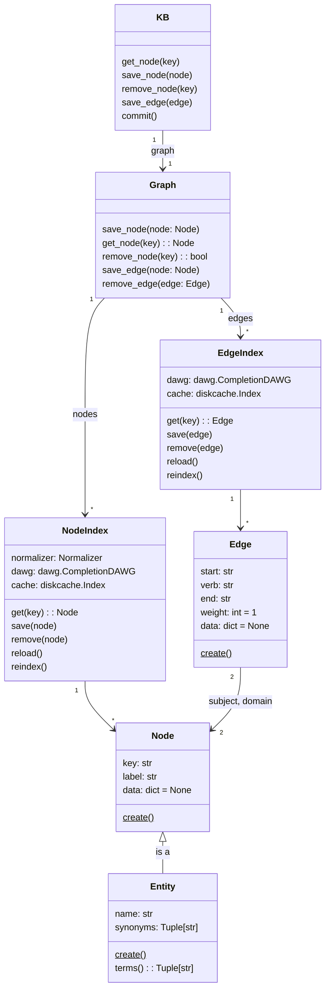

EntityKB stores concepts and their relationships in a graph-based
data structure. Concepts are represented by `Node` python classes and their
relationships are stored as `Edge` classes. An `Entity` is a type of node
with a name and list of synonyms. Nodes have a label and Edges have a verb
along with start and end node keys.

The Graph uses `NodeIndex` and `EdgeIndex` to store and retrieve
nodes and edges in a high performance manner.

## Class Diagram

Below is subsection of the full [reference class diagram](reference.md#class-diagram).

