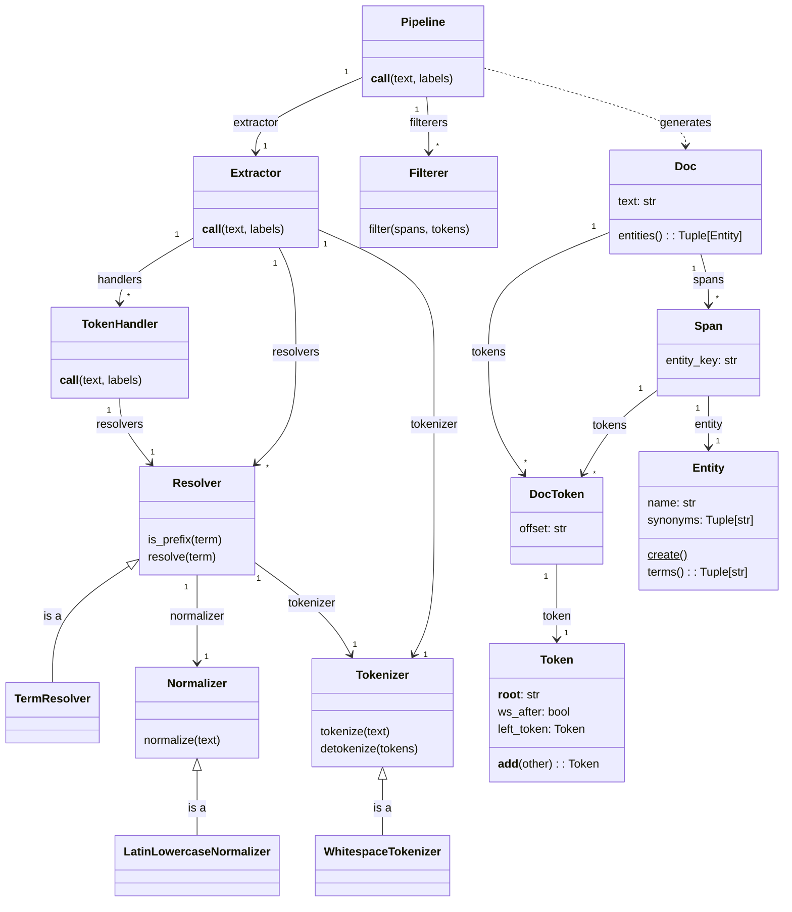

The processing pipeline normalizes and tokenizes text and then resolves
entities from spans of tokens. At the end of this process, the pipeline 
returns a `Doc` object with those tokens, spans and entities.

## Customization

All of the components of the `Pipeline` can be customized and overridden
using the `config.json` file. However, creating custom `Resolver` and
`Filterer` classes are the suggested places to start.

### Custom Resolvers

A resolver is a class that are given terms to identify spans of text that
are entities. There are 2 functions that must be implemented:

```python
from typing import List
from entitykb import Resolver, Entity

class MyCustomResolver(Resolver):

    def is_prefix(self, term: str) -> bool:
        ...

    def resolve(self, term: str) -> List[Entity]:
        ...
```

The method `is_prefix` should be a fast evaluation that the term is
either the start of or the full term of an Entity. The method `resolve`
should return the list of entities that can be fully resolved. The
pipeline and it's extractor logic handles the iterating of tokens and
the collection of spans that contain the resolved entities.

For instance, a "City Resolver" that knows about "New York City"
should have the `is_prefix` method return True for the terms "New",
"New York" and "New York City".  The `resolve` method should return
a list containing the Entity object but only for the full "New York
City".

The `TermsResolver` provides this functionality for loaded
entities, but it also would detect any synonyms such as "NYC".

### Custom Filterers

Once the pipeline has tokenized the text and collected all of the entities
as spans, there is a process of calling `Filterer` classes that have been
configured as part fo the pipeline. The `Filterer` classes are invoked in
order and their job is to remove or combine any spans/entities that they
wish.

A custom `Filter` needs to implement just 1 function, it should either
return the original list untouched or create a new list with just the
filtered spans.

```python
from typing import List
from entitykb import Span

class MyCustomFilterer(object):

    @classmethod
    def filter(cls, spans, tokens) -> List[Span]:
        ...
```


## Class Diagram



