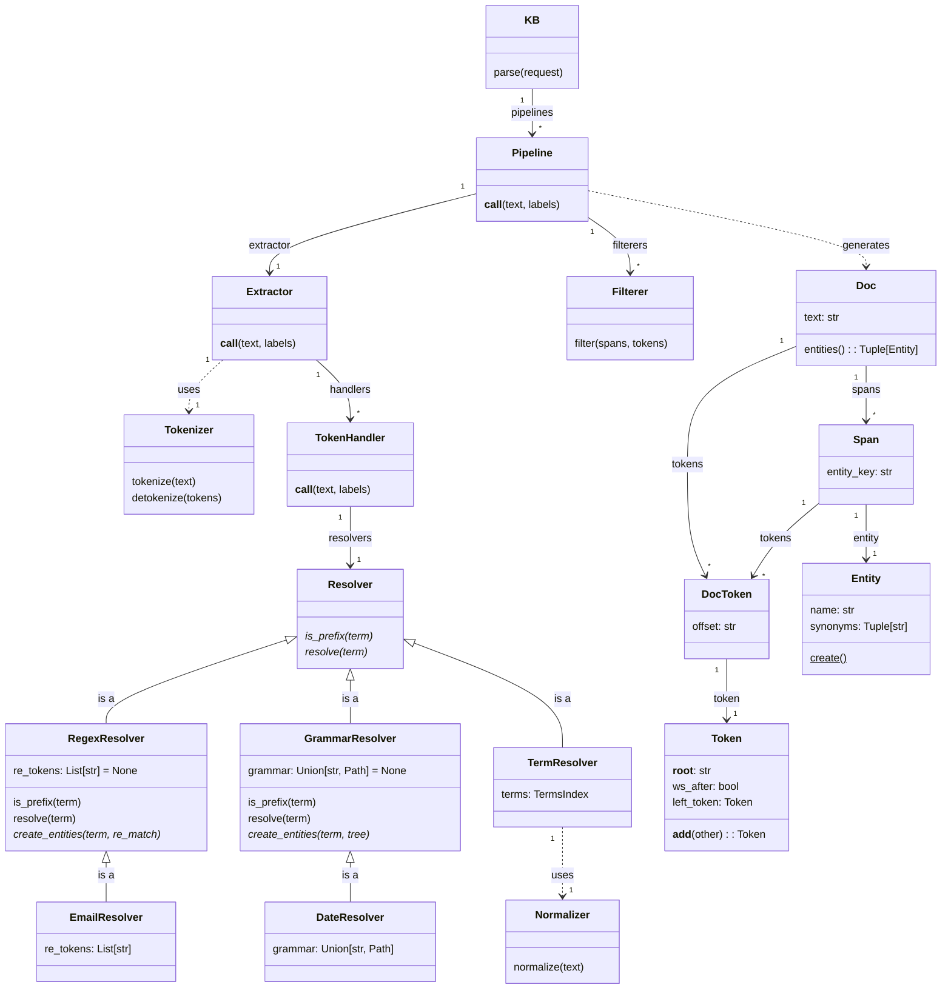

Knowledge Bases expose a method called `parse` which turns text into a
`Doc` object by calling a specific `Pipeline` that performs the following
steps:

1. `Extractor` calls `Tokenizer` to tokenize the text.
2. `Extractor` iterates tokens and manages state using it's `TokenHandler`.
3. `Resolvers` resolve tokens (term) into `Spans` that reference `Entities`.
4. `Filterers` process resolved `Spans` and remove, add, or combine them.
5. `Extractor` returns a `Doc` object with the tokens and entity spans.

### Configuration

Pipelines are configured using the KB's `config.json` file. Below is an
example config with the `DateResolver` and 2 out-of-the-box filterers added:

```json
{
    "graph": "entitykb.Graph",
    "modules": ["geokb"],
    "normalizer": "entitykb.LatinLowercaseNormalizer",
    "searcher": "entitykb.DefaultSearcher",
    "tokenizer": "entitykb.WhitespaceTokenizer",
    "pipelines": {
        "default": {
            "extractor": "entitykb.DefaultExtractor",
            "resolvers": [
                "entitykb.TermResolver",
                "entitykb.contrib.date.DateResolver"
            ],
            "filterers": [
                "entitykb.LowerNameOrExactSynonym",
                "entitykb.KeepLongestByOffset"
            ]
        }
    }
}
```

### Out of the Box Components

Below are the components that are provided by the base EntityKB project:

| Section                 | Item                                 | Description                                               | 
| ----------------------- | ------------------------------------ | --------------------------------------------------------- | 
| normalizer              | entitykb.LatinLowercaseNormalizer    | Default normalizer that converts text to lowercase ASCII. |
| tokenizer               | entitykb.WhitespaceTokenizer         | Default tokenizer that splits on whitespace characters.   |
| pipelines.extractor     | entitykb.DefaultExtractor            | Creates handlers, processes tokens, and collects spans.   |
| pipelines.filterers     | entitykb.ExactNameOnly               | Only keep spans that exactly match to the entity name.    |
| pipelines.filterers     | entitykb.KeepLongestByKey            | Keeps longest overlapping span with same node key.        |
| pipelines.filterers     | entitykb.KeepLongestByLabel          | Keeps longest overlapping span with same node label.      |
| pipelines.filterers     | entitykb.KeepLongestByOffset         | Keeps longest overlapping span using token offsets.       |
| pipelines.filterers     | entitykb.LowerNameOrExactSynonym     | Keeps when lower name or exact synonym match.             |
| pipelines.resolvers     | entitykb.TermResolver                | Resolves entities from terms using graph's term index.
| pipelines.resolvers     | entitykb.RegexResolver               | Abstract class for finding entities with regex patterns.  |
| pipelines.resolvers     | entitykb.GrammarResolver             | Abstract class for finding entities with Lark grammars.   |
| pipelines.resolvers     | entitykb.contrib.date.DateResolver   | Custom GrammarResolver that finds date entities.          |
| pipelines.resolvers     | entitykb.contrib.email.EmailResolver | Custom RegexResolver that finds email entities.           |

## Customization

All of the components of the `Pipeline` can be customized and overridden
using the `config.json` file. However, creating custom `Resolver` and
`Filterer` classes are the suggested places to start.

### Custom Resolvers

A resolver is a class that are given terms to identify spans of text that
are entities. There are 2 functions that must be implemented:

```python
from typing import List
from entitykb import Resolver, Entity

class MyCustomResolver(Resolver):

    def is_prefix(self, term: str) -> bool:
        ...

    def resolve(self, term: str) -> List[Entity]:
        ...
```

The method `is_prefix` should be a fast evaluation that the term is
either the start of or the full term of an Entity. The method `resolve`
should return the list of entities that can be fully resolved. The
pipeline and it's extractor logic handles the iterating of tokens and
the collection of spans that contain the resolved entities.

For instance, a "City Resolver" that knows about "New York City"
should have the `is_prefix` method return True for the terms "New",
"New York" and "New York City".  The `resolve` method should return
a list containing the Entity object but only for the full "New York
City". While this example is valid, it would be best implemented using
the `TermResolver` class described below.

#### Term Resolver

`TermResolver` resolves entities based on their names and synonyms. It
uses the `TermsIndex` of the knowledge graph to check token prefix validity
and resolve terms into entities.

This class is the default resolver for newly initialized KBs.

#### Regex Resolver

`RegexResolver` is an abstract base class that allows for the use
of regular expressions to resolve entities. The base class resolver
provides `is_prefix` and `resolve` methods that use a list of tokens
regular expressions provided by the derived class.

A derived class must provide a `re_tokens` class attribute that
is a list of regular expression strings that will be compiled using Python's
`re` module. The derived class must also implement a new method called
`create_entities` that receives the `term` and the `re.Match` object
that results from a `full_match` call.

See the `EmailResolver` class in the contrib package for an example 
implementation.

#### Grammar Resolver

`GrammarResolver` is an abstract base class that allows for the use
of [Lark](https://github.com/lark-parser/lark) grammars to resolve
entities. The base class resolver provides `is_prefix` and `resolve`
methods that use a Lark grammar provided by the derived class.

A derived class must provide a `grammar` class attribute that is
either a file Path object or a full text string of the grammar.
The derived class must also implement a new method called
`create_entities` that receives the `term` and the `lark.Tree`
object that results from a `parse` call using the Lark grammar.

See the `DateResolver` class in the contrib package for an example 
implementation.

<em>Note: Be warned that grammars are significantly more powerful than
"ordinary" regex, but it is also a very challenging programming
paradigm that requires lots of trial and error to learn.</em>


### Custom Filterers

Once the pipeline has tokenized the text and collected all of the entities
as spans, there is a process of calling `Filterer` classes that have been
configured as part fo the pipeline. The `Filterer` classes are invoked in
order and their job is to remove, add or combine any spans/entities.

A custom `Filterer` needs to implement just 1 function, it should either
return the original list untouched or create a new list with just the
filtered spans.

```python
from typing import List
from entitykb import Span

class MyCustomFilterer(object):

    @classmethod
    def filter(cls, spans, tokens) -> List[Span]:
        # todo: implement logic here and return new list
        new_spans = spans[:]
        return new_spans
```


## Class Diagram



