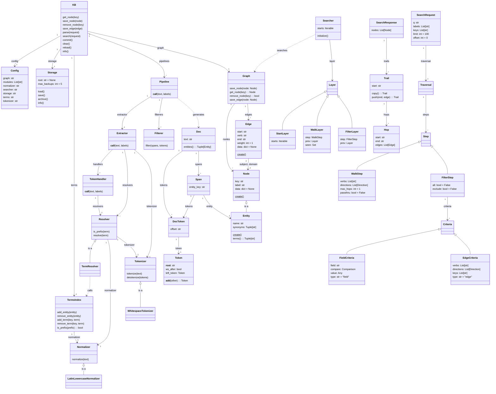

## Code Inventory

This [sortable table](https://squidfunk.github.io/mkdocs-material/reference/data-tables/#sortable-tables)
provides an inventory of important classes, modules, and functions.

| Module                | Item                      | Description                                               | 
| --------------------- | ---------------           | --------------------------------------------------------- | 
| cli                   | commands.py               | Functions that are available via command line.            |
| cli                   | readers.py                | Default file readers for CSV and JSONL file types.        |
| contrib.date          | date.lark                 | [Lark](https://github.com/lark-parser/lark) grammar.      | 
| contrib.date          | Date                      | Example entity with fields for year, month, day.          |
| contrib.date          | DateResolver              | Example resolver for finding Date entities.               |
| contrib.email         | Email                     | Example entity with fields for username and domain.       |
| contrib.email         | EmailResolver             | Example resolver that finds email entities.               |
| deps                  | Environ                   | Env vars that prevents setting previously read values.    |
| graph                 | Graph                     | Abstract class for graph reading and writing.             |
| graph                 | InMemoryGraph             | Default graph that keeps data in memory using indices.    |
| graph                 | NodeIndex                 | Stores nodes by their key and label for fast retrieval.   |
| graph                 | EdgeIndex                 | Stores edges for retrieval by verb, direction or node.    |
| http                  | admin                     | [Svelte](https://svelte.dev/)-based admin web UI.         |
| http                  | app                       | [FastAPI](https://fastapi.tiangolo.com/)-based HTTP API.  |
| http                  | dev                       | Startup and shutdown parallel RPC with hot reloading.     |
| http                  | prod                      | Default startup and shutdown functions.                   |
| http                  | routes                    | API declarations with delegation to RPC KB server.        |
| kb                    | KB                        | Embeddable, in-memory KB with core functions.             |
| models.doc            | Doc                       | Created by pipeline, contains text, spans, and tokens.    |
| models.doc            | Span                      | Span is a set of tokens and a resolved entity.            |
| models.doc            | DocToken                  | Token plus it's offset within the Doc.                    |
| models.doc            | Token                     | String of the token with helper functions for detokenize. |
| models.entity         | Entity                    | Node with name, synonyms and key ("`name|LABEL`").        |
| models.enums          | Direction                 | Traversal and index flag for incoming or outcoming.       |
| models.enums          | Comparison                | Criteria flag for search filtering (i.e. less than).      |
| models.node           | Node                      | Base class for objects (key, label, data) stored in graph.|
| models.node           | Edge                      | Base class for relationships (verb) between nodes.        |
| models.registry       | Registry                  | Creates nodes and edges from dict based on label/verb.    |
| models.registry       | Schema                    | Pydantic schema of nodes by labels and edges by verbs.    |
| models.registry       | Lookup                    | Mapping of labels to Node type and verbs to Edge types.   |
| models.search         | SearchRequest             | Container for search starts, traversal, limit, and offset.| 
| models.search         | SearchResponse            | Container for nodes and trails returned from search.      |
| models.search         | Trail                     | Search path from start node through a series of hops.     |
| models.search         | Hop                       | Search step from start to end node via 1 or more edges.   |
| models.traverse       | Verb                      | String with operator overrides for creating edge criteria.|
| models.traverse       | F                         | Helper class with operator override for field criteria.   |
| models.traverse       | T                         | Short-cut for Traversal class.                            |
| models.traverse       | Traversal                 | Collector of traversal steps with walk and filter helpers.|
| models.traverse       | WalkStep                  | Instruct searcher to hop via edges to neighboring nodes.  |
| models.traverse       | FilterStep                | Filter searching based on criteria with all/exclude flags.|
| models.traverse       | EdgeCriteria              | Filtering criteria based on edges and neighboring nodes.  |
| models.traverse       | FieldCriteria             | Filtering criteria based on node field value.             |
| pipeline.extractor    | Extractor                 | Base-class for extracting document from text.             |
| pipeline.extractor    | DefaultExtractor          | Creates handlers, processes tokens, and collects spans.   |
| pipeline.filterer     | Filterer                  | Base class for filtering spans.                           |
| pipeline.filterer     | ExactNameOnly             | Only keep spans that exactly match to the entity name.    |
| pipeline.filterer     | KeepLongestByKey          | Keeps longest overlapping span with same node key.        |
| pipeline.filterer     | KeepLongestByLabel        | Keeps longest overlapping span with same node label.      |
| pipeline.filterer     | KeepLongestByOffset       | Keeps longest overlapping span using token offsets.       |
| pipeline.filterer     | LowerNameOrExactSynonym   | Keeps when lower name or exact synonym match.             |
| pipeline.handler      | TokenHandler              | Manages resolver prefix tokens state during extraction.   |
| pipeline.normalizers  | Normalizer                | Base class for normalizing text.                          |
| pipeline.normalizers  | LatinLowercaseNormalizer  | Default normalizer that converts text to lowercase ASCII. |
| pipeline.pipeline     | Pipeline                  | Container of resolvers and filterers, does extract/filter.|
| pipeline.resolvers    | Resolver                  | Base class with is_prefix and resolve methods.            |
| pipeline.resolvers    | TermResolver              | Resolves entities from terms using TrieTermsIndex.        |
| pipeline.tokenizers   | Tokenizer                 | Base class with tokenize and detokenize methods.          |
| pipeline.tokenizers   | WhitespaceTokenizer       | Default tokenizer that splits on whitespace characters.   |
| rpc.client_async      | AsyncKB                   | Remote KB client that supports async/await calls.         |
| rpc.client_sync       | SyncKB                    | Remote KB client that supports synchronous calls.         |
| rpc.connection        | RPCConnection             | Connection manager used by KB clients and RPC server.     |
| rpc.server            | RPCServer                 | Asyncio socket server that handles RPC calls.             |
| rpc.server            | HandlerKB                 | Used by RPCServer to delegate calls to in-memory KB.      |
| searcher              | Searcher                  | Base class Searcher uses starts and steps to yield trails.|
| searcher              | DefaultSearcher           | Naive first implementation that uses layered generators.  |
| searcher              | StartLayer                | Generator layer that yields trail objects from start keys.|
| searcher              | WalkLayer                 | Layer that recursively walks graph using walk steps.      |
| searcher              | FilterLayer               | Layer that filters trails based on edge or field criteria.|
| storage               | Storage                   | Base class for saving and loading KB data.                |
| storage               | PickleStorage             | Default storage class that uses pickle (de)serialization. |
| terms                 | TermsIndex                | Base class for storing/retrieving entity terms.           |
| terms                 | TrieTermsIndex            | Default terms index built using [pyahocorasick](https://pyahocorasick.readthedocs.io/en/latest/).|
| config                | Config                    | Handles reading and writing of KB configuration files.    |
| config                | PipelineConfig            | Describes configuration of each named pipeline in KB.     |
| env                   | Environ                   | Default environment values with getter/setter properties. |

## Class Diagram

This [mermaid diagram](https://mermaid-js.github.io/mermaid/#/classDiagram)
shows the major components of EntityKB and how they interrelate. See other
sections for better viewing of specific subsections or try zooming.

