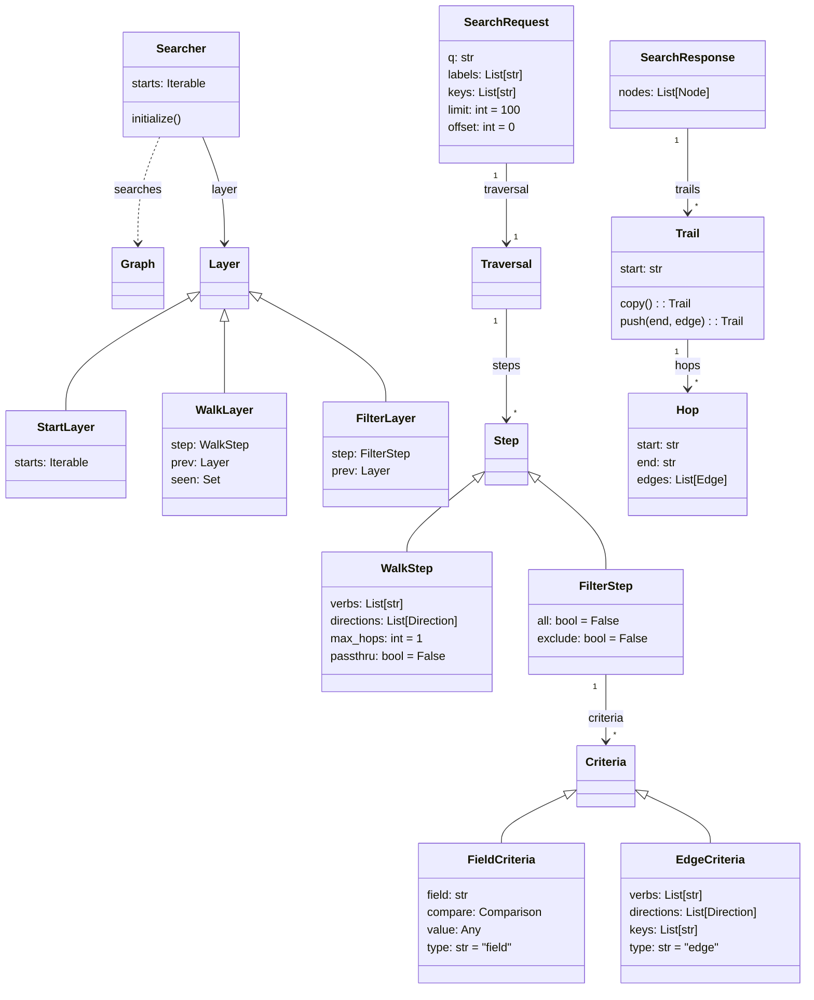

EntityKB comes with a basic searching capability that allows for the
traversal of the graph.

A `SearchRequest` takes the following structure:

```python
class SearchRequest(BaseModel):
    q: str
    labels: List[str]
    keys: List[str]
    traversal: Traversal
    limit: int = 100
    offset: int = 0
```

Searching on a graph needs to "start" somewhere and then take
"steps". The search then yields records that fall on or after the
offset index and stopping once the count has reached the limit or
no more results are found.

### starts

The search request includes 3 fields for "starts": q, labels, and keys.

* `q` and `keys` are mutually exclusive.

* If you provide a `q` the default searcher will request the related
  keys from the terms index and yield them out.
  
* If you provide `keys`, the searcher will iterate and yield all of those
  keys provided.
  
* If `labels` are provided, it will be used to filter keys being yielded
  for `q` or `keys`.
  
* If neither `q` or `keys` are provided, then all of the nodes for a
  `label` are yielded.
  
* If nothing is provided, then all of the nodes will be yielded.


### traversal steps

A traversal is a series of steps that will either hop to neighboring
nodes (walk step) or filter (filter step) by either a field or edge
criteria.

The `Traversal` class and associated classes (Verb or V,
FieldCriteriaBuilder or F) provide a fluent python interface that
uses python operator overloading to provide a lightweight DSL for
query creation.

### Example

Below is an example search request that will find all of the cities
located in countries that are on the continent of Asia.

```python
from entitykb import T, V, F, SearchRequest, AsyncKB

kb = AsyncKB()

traversal = (
    T()
    .include(V.ON_CONTINENT >> "AS|CONTINENT")
    .in_nodes("LOCATED_IN")
    .include(F.population.range(100, 200))
)

request = SearchRequest(labels=["COUNTRY"], traversal=traversal)
response = kb.search(request)
print(response.nodes)
```

This query starts by iterating all of the countries (labels = "COUNTRY"),
filtering in the ones on Asia ((V.ON_CONTINENT >> "AS|CONTINENT"), walking
to the incoming nodes with the verb LOCATED_IN and then filtering
on the cities population.

This would find the city West Island in the country of the Cocoa Islands
by walking the graph.

```python
[City(key='7304591|CITY', label='CITY', data=None, name='West Island',
synonyms=('weseuteu seom', '웨스트 섬'), code='7304591', latitude=-12.15681,
longitude=96.82251, population=120, timezone='Indian/Cocos', elevation=None)]
```


## Class Diagram


